# Prism Extension Styles for WP Editor.md

## 描述 Description

一些WP Editor.md可以使用的第三方Prism.js代码高亮主题。

Some third-party Prism.js extension styles for WP Editor.md.

## 如何使用 How to use

复制🔗开头的链接，将其粘贴在WP Editor.md设置页面中的『自定义风格样式部分』即可生效。

Copy the link(start with 🔗) of the following available themes, and paste it to the "Customize Style Library" section in WP Editor.md's settings page.

[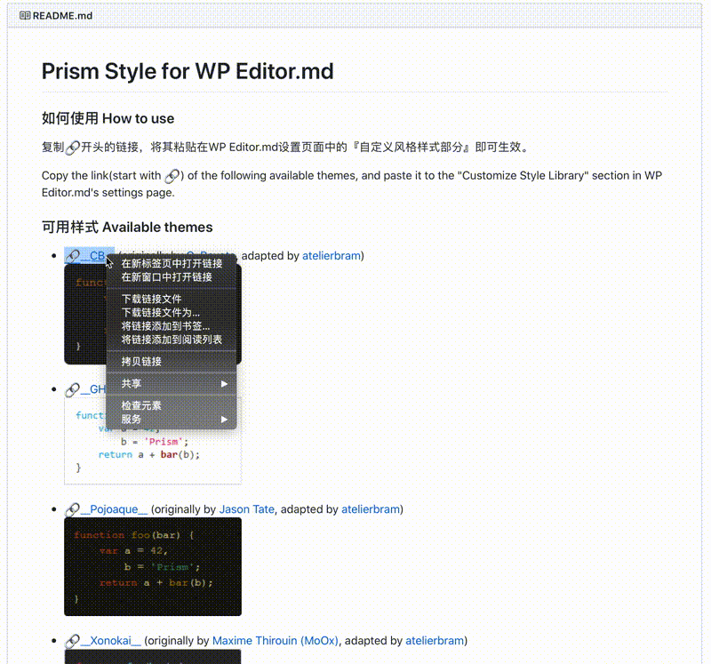](screenshots/howtouse.gif)

## 可用样式 Available styles

* [🔗__CB__](https://cdn.jsdelivr.net/wp/wp-editormd/assets/prismjs-style/CB/prism-cb.min.css) (originally by [C. Bavota](https://bitbucket.org/cbavota), adapted by [atelierbram](https://github.com/atelierbram)) 
[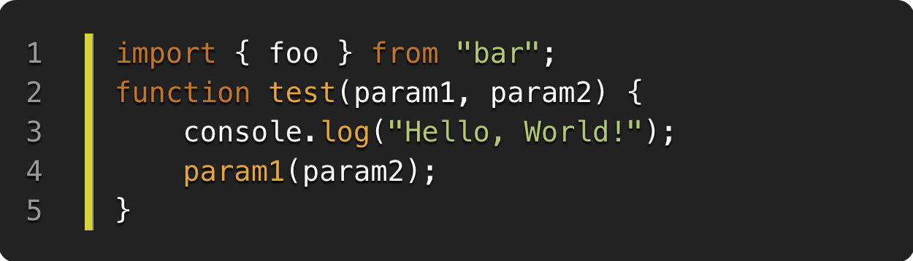](CB/prism-cb.min.css)

* [🔗__GHColors__](https://cdn.jsdelivr.net/wp/wp-editormd/assets/prismjs-style/Ghcolors/prism-ghcolors.min.css) (by [aviaryan](https://github.com/aviaryan)) 
[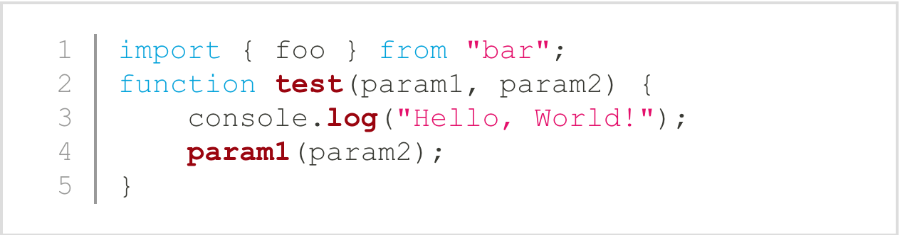](Ghcolors/prism-ghcolors.min.css)

* [🔗__Pojoaque__](https://cdn.jsdelivr.net/wp/wp-editormd/assets/prismjs-style/Pojoaque/prism-pojoaque.min.css) (originally by [Jason Tate](http://web-cms-designs.com/ftopict-10-pojoaque-style-for-highlight-js-code-highlighter.html), adapted by [atelierbram](https://github.com/atelierbram)) 
[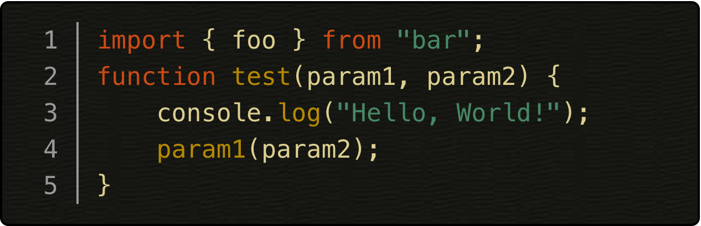](Pojoaque/prism-pojoaque.min.css)

* [🔗__Xonokai__](https://cdn.jsdelivr.net/wp/wp-editormd/assets/prismjs-style/Xonokai/prism-xonokai.min.css) (originally by [Maxime Thirouin (MoOx)](https://github.com/MoOx), adapted by [atelierbram](https://github.com/atelierbram)) 
[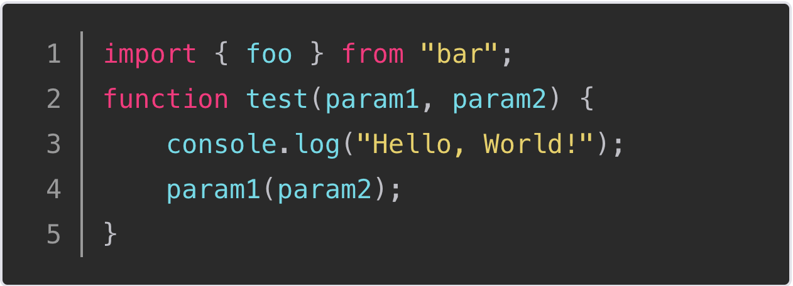](Xonokai/prism-xonokai.min.css)

* [🔗__Ateliersulphurpool-light__](https://cdn.jsdelivr.net/wp/wp-editormd/assets/prismjs-style/Base16AteliersulphurpoolLight/prism-base16-ateliersulphurpool.light.min.css) (by [Bram de Haan](https://github.com/atelierbram)) 
[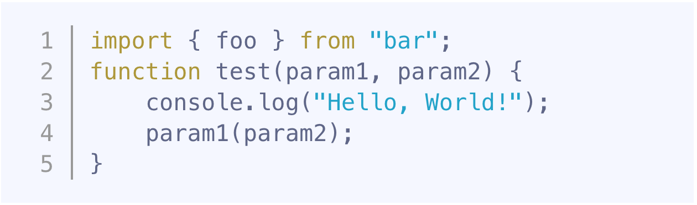](Base16AteliersulphurpoolLight/prism-base16-ateliersulphurpool.light.min.css)

* [🔗__Hopscotch__](https://cdn.jsdelivr.net/wp/wp-editormd/assets/prismjs-style/Hopscotch/prism-hopscotch.min.css) (by [Jan T. Sott](https://github.com/idleberg)) 
[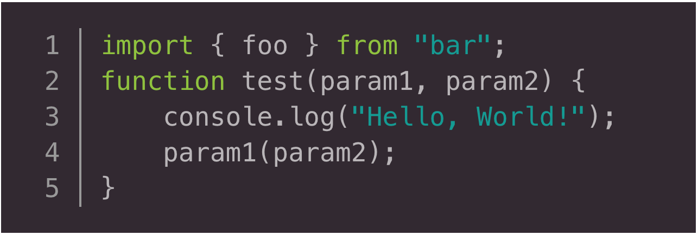](Hopscotch/prism-hopscotch.min.css)

* [🔗__Atom Dark__](https://cdn.jsdelivr.net/wp/wp-editormd/assets/prismjs-style/AtomDark/prism-atom-dark.min.css) (by [gibsjose](https://github.com/gibsjose), based on [Atom Dark Syntax theme](https://github.com/atom/atom-dark-syntax)) 
[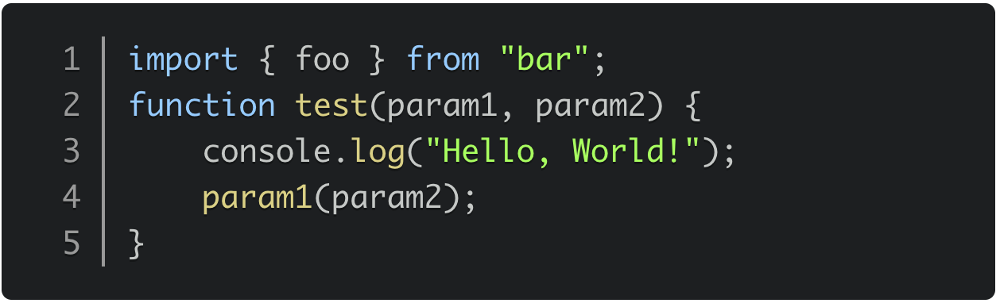](AtomDark/prism-atom-dark.min.css)

* [🔗__Duotone Dark__](https://cdn.jsdelivr.net/wp/wp-editormd/assets/prismjs-style/DuotoneDark/prism-duotone-dark.min.css) (by [Simurai](https://github.com/simurai), based on [Duotone Dark Syntax theme for Atom](https://github.com/simurai/duotone-dark-syntax)) 
[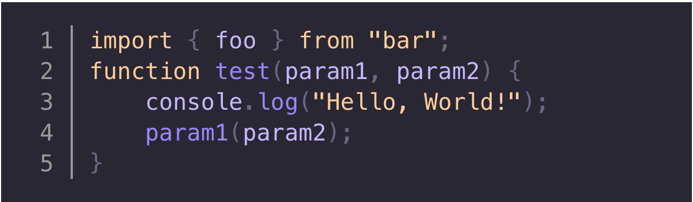](DuotoneDark/prism-duotone-dark.min.css)

* [🔗__Duotone Sea__](https://cdn.jsdelivr.net/wp/wp-editormd/assets/prismjs-style/DuotoneSea/prism-duotone-sea.min.css) (by [Simurai](https://github.com/simurai), based on [DuoTone Dark Sea Syntax theme for Atom](https://github.com/simurai/duotone-dark-sea-syntax)) 
[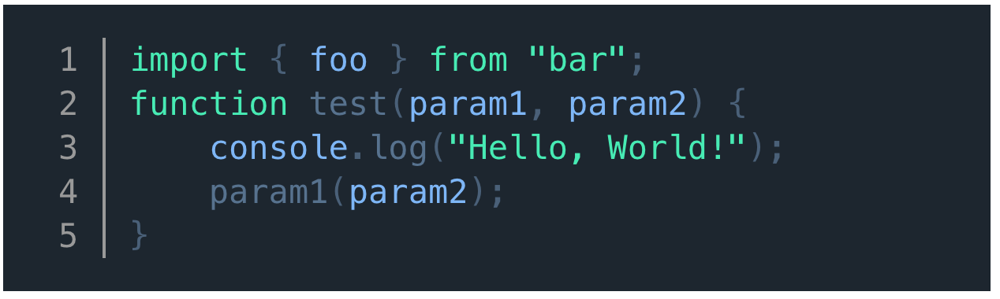](DuotoneSea/prism-duotone-sea.min.css)

* [🔗__Duotone Space__](https://cdn.jsdelivr.net/wp/wp-editormd/assets/prismjs-style/DuotoneSpace/prism-duotone-space.min.css) (by [Simurai](https://github.com/simurai), based on [DuoTone Dark Space Syntax theme for Atom](https://github.com/simurai/duotone-dark-space-syntax)) 
[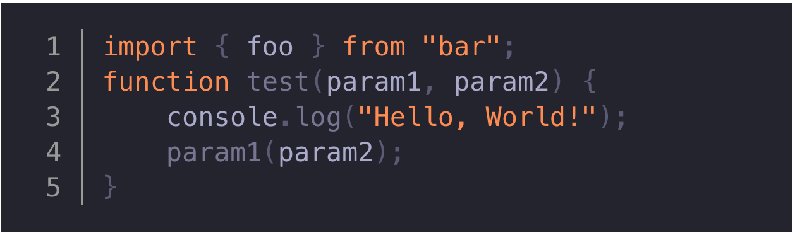](DuotoneSpace/prism-duotone-space.min.css)

* [🔗__Duotone Earth__](https://cdn.jsdelivr.net/wp/wp-editormd/assets/prismjs-style/DuotoneEarth/prism-duotone-earth.min.css) (by [Simurai](https://github.com/simurai), based on [DuoTone Dark Earth Syntax theme for Atom](https://github.com/simurai/duotone-dark-earth-syntax)) 
[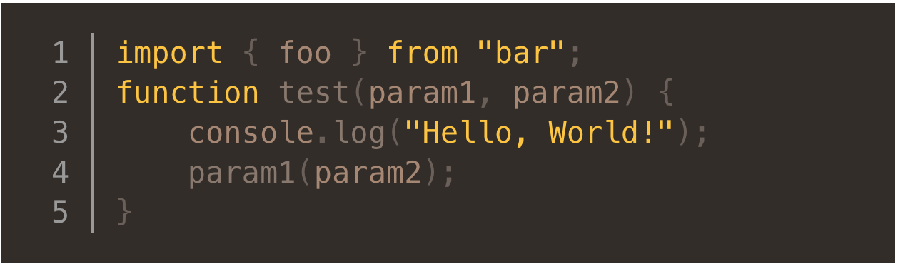](DuotoneEarth/prism-duotone-earth.min.css)

* [🔗__Duotone Forest__](https://cdn.jsdelivr.net/wp/wp-editormd/assets/prismjs-style/DuotoneForest/prism-duotone-forest.min.css) (by [Simurai](https://github.com/simurai), based on [DuoTone Dark Forest Syntax theme for Atom](https://github.com/simurai/duotone-dark-forest-syntax)) 
[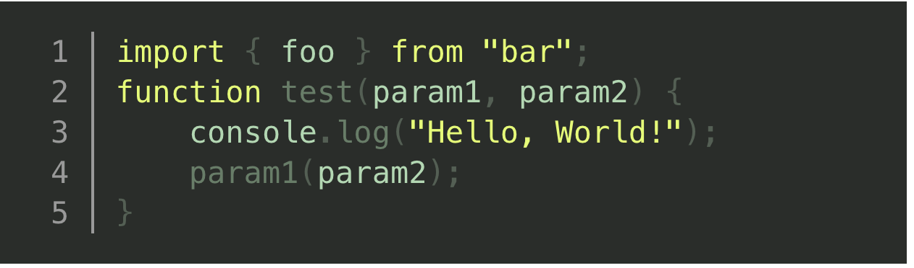](DuotoneForest/prism-duotone-forest.min.css)

* [🔗__Duotone Light__](https://cdn.jsdelivr.net/wp/wp-editormd/assets/prismjs-style/DuotoneLight/prism-duotone-light.min.css) (by [Simurai](https://github.com/simurai), based on [DuoTone Light Syntax theme](https://github.com/simurai/duotone-light-syntax)) 

* [🔗__VS__](https://cdn.jsdelivr.net/wp/wp-editormd/assets/prismjs-style/VS/prism-vs.min.css) (by [andrewlock](https://github.com/andrewlock)) 
[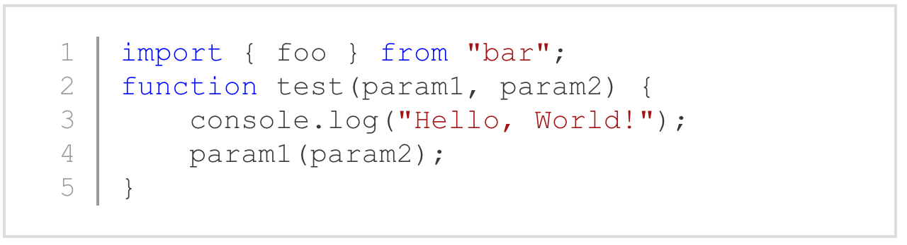](VS/prism-vs.min.css)

* [🔗__Darcula__](https://cdn.jsdelivr.net/wp/wp-editormd/assets/prismjs-style/darcula/prism-darcula.min.css) (by [service-paradis](https://github.com/service-paradis), based on Jetbrains Darcula theme) 
[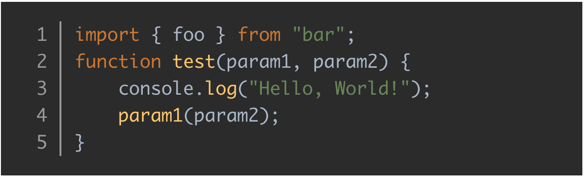](darcula/prism-darcula.min.css)

* [🔗__a11y Dark__](https://cdn.jsdelivr.net/wp/wp-editormd/assets/prismjs-style/A11yDark/prism-a11y-dark.min.css) (by [ericwbailey](https://github.com/ericwbailey)) 
[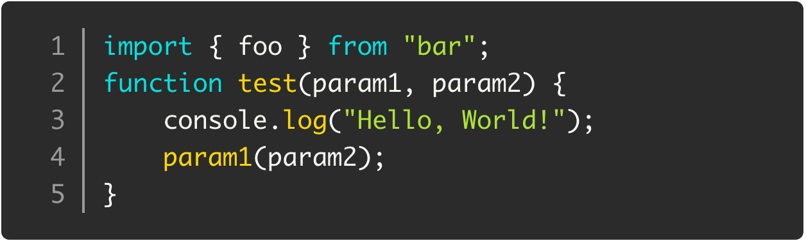](A11yDark/prism-a11y-dark.min.css)

* [🔗__MDN__](https://cdn.jsdelivr.net/wp/wp-editormd/assets/prismjs-style/MDN/prism-mdn.min.css) 
